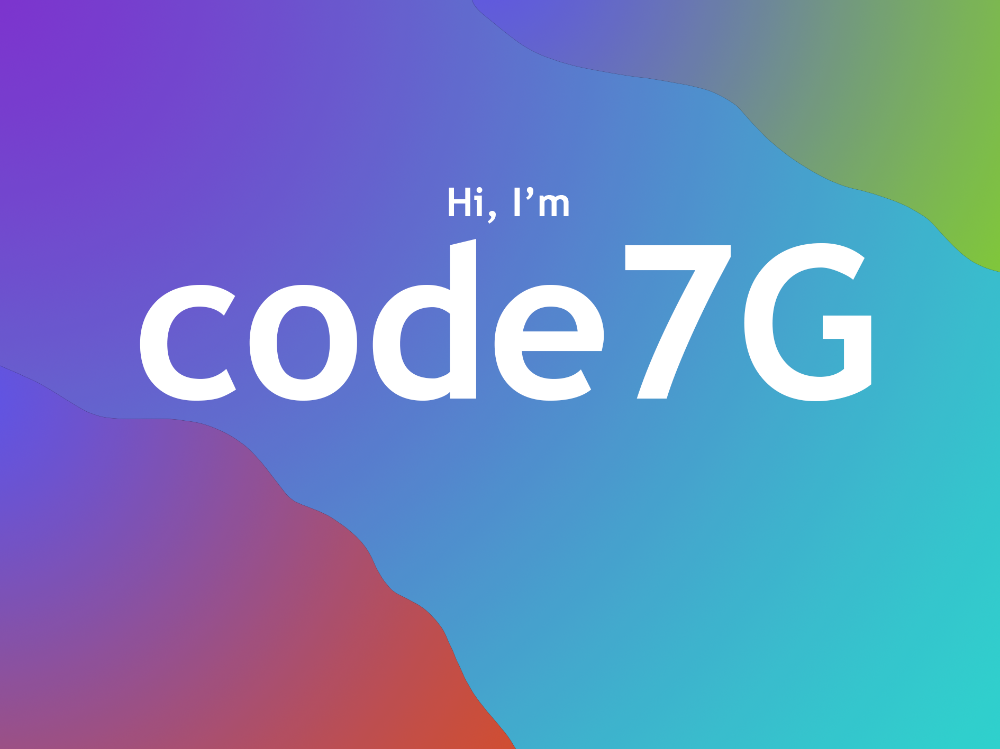

I have a large interest in powerful and world changing technologies such as AI.
I have worked on and researched new AI technologies such as AGI and ASI.
My primary programming language is python although I can adapt to other ways of programming.
I'm passionate about leveraging AI to solve complex problems and enhance human experiences.
With a strong foundation in software development, I strive to create innovative solutions that push the boundaries of what's possible.

Have a great day!

<!---
Code7G/Code7G is a ✨ special ✨ repository because its `README.md` (this file) appears on your GitHub profile.
You can click the Preview link to take a look at your changes.
--->
